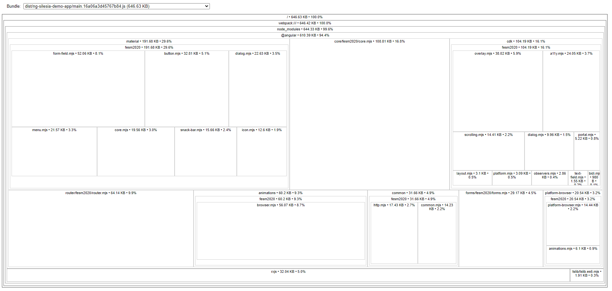

# NgSilesiaDemo

This project was generated with [Angular CLI](https://github.com/angular/angular-cli) version 15.2.10.

## Backend server

Run `npm run server` for a backend server. Navigate to `http://localhost:3000` to see available API. Used json-server package: `https://github.com/typicode/json-server`

## Development server

Run `ng serve` for a dev server. Navigate to `http://localhost:4200/`. The application will automatically reload if you change any of the source files.

## Build

Run `ng build` to build the project. The build artifacts will be stored in the `dist/` directory.

## Run bundle analyzer

Run `npm run source` for a bundle graph in order to analyze DI and components place in bundles. You can also use `npm run source:result` to export result to the result.json file for a static analysis. **Remember to first build application**.

## Application after standalone migration

Application code after standalone migration can be found on the branch [app-full-standalone](https://github.com/krysiasti/ng-silesia-v16-demo-app/tree/app-full-standalone)

## Further help

To get more help on the Angular CLI use `ng help` or go check out the [Angular CLI Overview and Command Reference](https://angular.io/cli) page.
